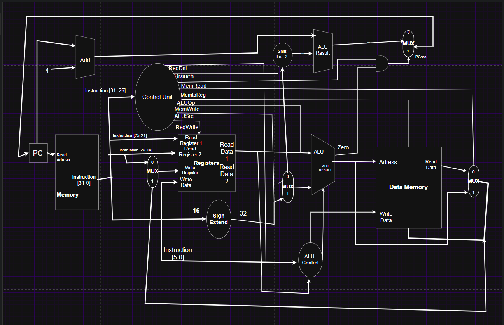

# ECE251 - Comp Arc Final Project
# BY Fatin Hoque, Ishmam Raiyan

## Description
The Computer Architecture projects applies a 32 bit single-cycle CPU using SystemVerilog. The design is based on the ISA strucure and uses it to suports R, I, J -type instructions. The Verilog based CPU is able to execute aritmetic, control flow, logic, and memory instructions.

# CPU Design and Documentation
 
